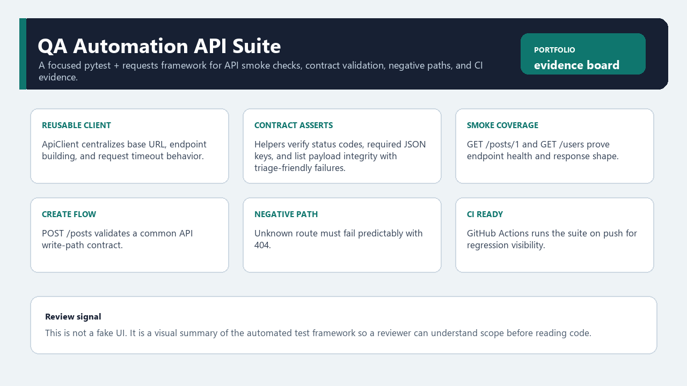

# QA Automation API Suite

Compact Python QA project for API test automation, contract checks, and CI-backed validation.



## What This Project Demonstrates
- API smoke tests and endpoint health checks
- Response schema/contract assertions
- Negative-path validation (error status behavior)
- Environment-configurable base URL through `QA_API_BASE_URL`
- Reusable request layer with default headers, query parameters, JSON payloads, and timeout control
- Response metadata checks: content type and practical latency budget
- CI execution on every push (GitHub Actions)
- Small framework structure: reusable API client, pytest fixture, and assertion helpers
- Automation-focused test strategy, microservices testing plan, Agile QA workflow, and QA metrics documentation
- Python QA learning translated into reviewable repository structure, docstrings, tests, and QA documentation

## Tech
Python, pytest, requests, GitHub Actions.

## Framework Structure
- `src/qa_automation_api_suite/client.py`: reusable API client wrapper
- `src/qa_automation_api_suite/assertions.py`: reusable assertion helpers
- `tests/conftest.py`: pytest fixture setup
- `tests/test_api_contracts.py`: smoke, contract, create-flow, and negative-path tests
- `docs/`: test strategy, microservices testing plan, Agile workflow, QA metrics

## Visual Review
The screenshot above is an evidence board for the automation scope. It summarizes the framework,
checks, and CI signal so a reviewer can understand the project before
opening the test files.

## Engineering Learning Signals
- Test code is separated from reusable client/assertion helpers.
- Assertions include triage-friendly failure messages.
- Documentation explains automation strategy, microservices thinking, Agile QA workflow, and quality metrics.
- The repository is intentionally small enough to inspect quickly, while still showing framework thinking.

## Proof of Work
- Tests exercise smoke paths, response contracts, query parameters, create-flow behavior, and a negative route.
- `QA_API_BASE_URL` allows the same tests to target another compatible environment.
- CI runs the suite on GitHub Actions so failures are visible outside a local machine.
- Docs explain test strategy, microservices testing awareness, Agile QA workflow, and QA metrics in practical terms.

## Difficult Parts / Tradeoffs
- The suite uses a public demo API to stay easy to run; that limits how much stateful or destructive testing can be shown.
- Contract checks are strict enough to catch shape changes, but not so strict that the tests become unreadable.
- The project is intentionally focused on API QA instead of becoming a mixed product app.

## Test Scope
- `GET /posts/1`: status and payload shape
- `GET /users`: list integrity and required fields
- `GET /posts?userId=1`: query parameter filtering and relationship consistency
- `POST /posts`: basic create flow and response contract
- `GET /invalid-route`: expected 404 behavior

## Run Locally
```bash
python -m venv .venv
.venv\Scripts\python -m pip install -U pip
.venv\Scripts\python -m pip install -e .
.venv\Scripts\python -m pytest
```

Optional target override:
```bash
$env:QA_API_BASE_URL="https://jsonplaceholder.typicode.com"
.venv\Scripts\python -m pytest
```

## Why It Matters for QA Roles
This repository is intentionally dedicated to automated API validation and repeatable CI checks,
separate from product/UI projects.

## Engineering Notes
See ENGINEERING_NOTES.md for QA-oriented reasoning, design tradeoffs, and learning summary.

## Learning Map
See `docs/QA_LEARNING_MAP.md` for the connection between Python learning, QA automation practice, and portfolio evidence.

